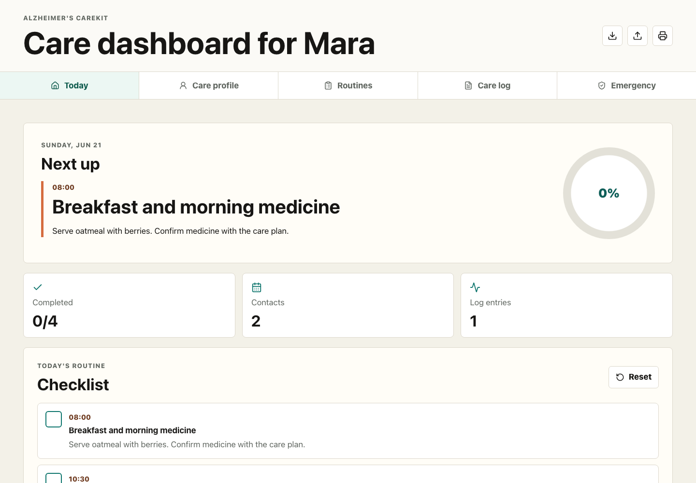

# Alzheimer's CareKit

Alzheimer's CareKit is a local-first caregiver dashboard for routines, care notes, important contacts, and printable emergency information.

The app is designed for families and small care teams that need a simple place to keep person-centered details organized without creating an account or sending private care data to a server.



## Features

- Today dashboard with routine progress and the next care item
- Care setup checklist for profile, comfort plan, contacts, and routines
- Shift handoff brief with one-click copy
- Printable shift packet with routines, recent notes, contacts, and care profile
- Mood-tagged quick care notes from the dashboard
- Person-centered care profile with comfort items, calming activities, and notes
- Routine checklist with add, reset, complete, remove, search, and filter actions
- Care circle contacts with tap-to-call links
- Daily care log with mood, sleep, appetite, notes, search, and CSV export
- JSON backup import/export
- Printable emergency card
- Large touch targets, high contrast, skip navigation, and simple navigation

## Privacy model

Data is stored in the browser using `localStorage`. There is no backend, login, analytics, or network sync in this first version. Exported files are created on the device.

## Safety note

This project is a caregiver organization tool. It does not provide medical advice, diagnosis, treatment recommendations, monitoring, or emergency guidance. Always follow the person's care plan and contact qualified professionals or emergency services when needed.

## Getting started

```bash
npm install
npm run dev
```

## Scripts

```bash
npm run dev
npm run build
npm run lint
npm run test:e2e
npm run preview
```

## Roadmap

- Multi-person profiles
- Optional encrypted backup file
- Recurring routine templates
- Better print layouts for handoff sheets
- Offline install prompts
- Localization support

## Contributing

Issues and pull requests are welcome. Please keep product claims conservative and avoid features that imply diagnosis, treatment, surveillance, or clinical decision-making.
